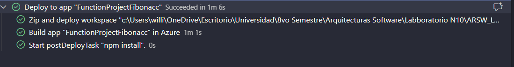
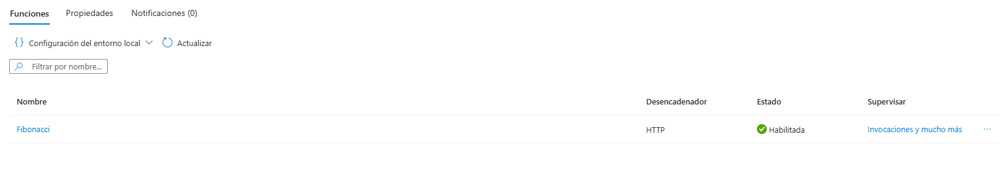
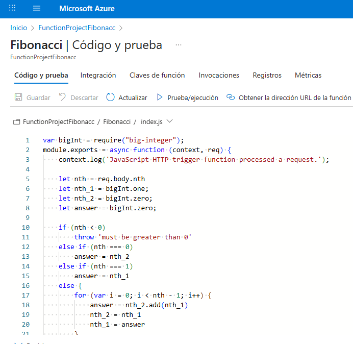
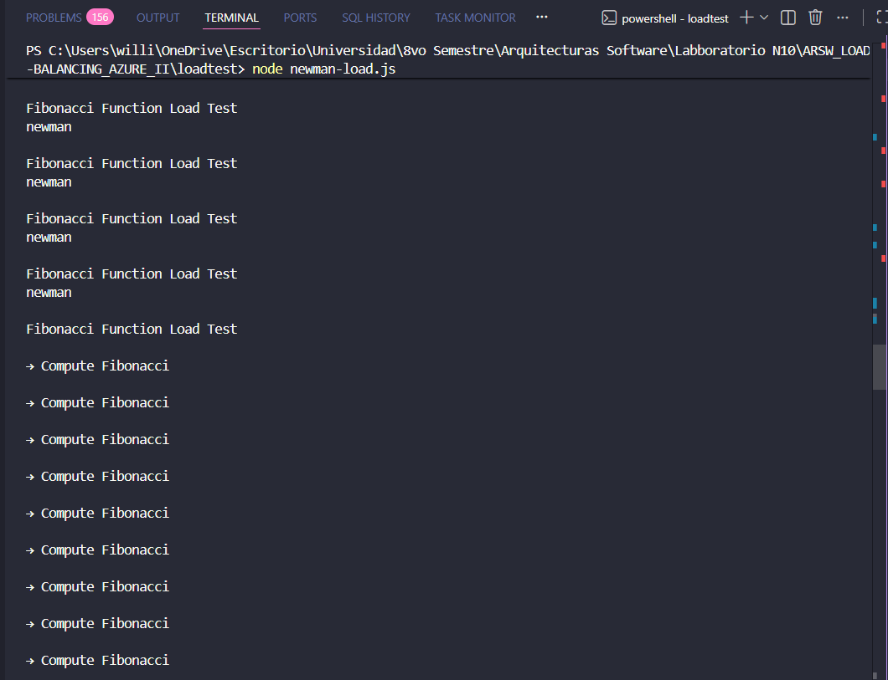
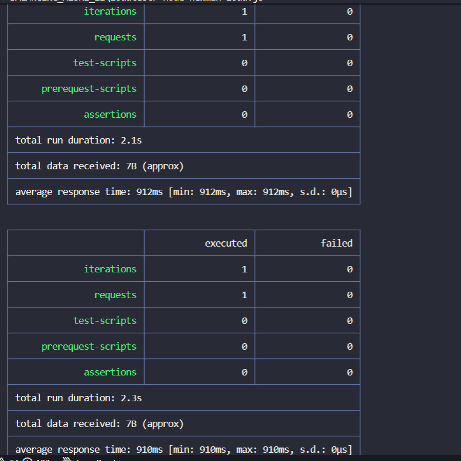

### Escuela Colombiana de Ingeniería
### Arquitecturas de Software - ARSW

### Integrantes
- Manuel David Robayo Vega
- William Camillo Hernandez Deaza

## Escalamiento en Azure con Maquinas Virtuales, Sacale Sets y Service Plans

### Escalabilidad Serverless (Functions)

1. Creamos una Function App con las siguientes configuraciones:

2. Instalamos la extensión de Azure Functions en Visual Studio Code.

3. Desplegamos la aplicación desde Azure

4. Podemos comprobar en el portal de Azure su funcionamiento

5. Modifique la coleción de POSTMAN con NEWMAN de tal forma que pueda enviar 10 peticiones concurrentes. Verifique los resultados y presente un informe.

### Informe Paso 5 (Load Test Fibonacci)

Se implementó un script de prueba de carga con Newman que ejecuta 10 peticiones concurrentes al endpoint `/api/Fibonacci` con `nth=35`.

**Resultados:**
- **Duración total:** 8,338 ms (~8.3 segundos)
- **Total de requests:** 10
- **Tasa de éxito:** 100% (0 fallos)
- **Tiempo de respuesta promedio:** 986.6 ms
- **Rango de tiempos:** 730 ms (mín) - 1,630 ms (máx)

**Observaciones clave:**
- No se detectó cold start (primera request fue la más rápida).
- Alta variabilidad en tiempos de respuesta sugiere contención de recursos en instancia única.
- Azure Functions en plan Consumption manejó la carga sin throttling ni errores.
- La función escala correctamente, pero con latencias inconsistentes bajo concurrencia.

**Archivos generados:**
- `loadtest/reports/aggregate.json` - Métricas agregadas
- `loadtest/reports/run-*.html` - Reportes detallados de cada ejecución
- `REPORT.md` - Análisis completo con conclusiones sobre escalabilidad

6. Cree una nueva Function que resuleva el problema de Fibonacci pero esta vez utilice un enfoque recursivo con memoization. Pruebe la función varias veces, después no haga nada por al menos 5 minutos. Pruebe la función de nuevo con los valores anteriores. ¿Cuál es el comportamiento?.

### Implementación FibonacciMemo

Se creó la función `FibonacciMemo` con enfoque recursivo y caché en memoria (memoization).

**Comportamiento esperado (Paso 6):**

1. **Primera ejecución (nth=35):**
   - Cache vacío → 35 cache misses
   - Calcula y guarda todos los valores de 0 a 35
   - Tiempo: ~100-200ms (recursión + almacenamiento)

2. **Segunda ejecución inmediata (nth=35):**
   - Cache completo → 1 cache hit
   - No requiere cálculo, devuelve valor del caché
   - Tiempo: <10ms (acceso directo a memoria)

3. **Tercera ejecución (nth=40):**
   - Cache parcial (0-35 ya existen) → 35 cache hits + 5 cache misses
   - Solo calcula valores 36-40
   - Tiempo: ~50ms (aprovecha caché existente)

4. **Después de 5+ minutos de inactividad:**
   - **Cold start:** Azure desasigna la instancia por inactividad
   - **Cache perdido:** La memoria de la función se resetea
   - Al ejecutar de nuevo (nth=35):
     - `instanceStartTime` será un timestamp nuevo
     - Cache vacío nuevamente → 35 cache misses
     - Tiempo: ~100-200ms + overhead de cold start (500-1000ms adicionales)

**¿Por qué falla la memoization?**

La memoization en memoria **NO persiste** en Azure Functions Consumption Plan porque:

1. **Instancias efímeras:** Después de ~5-10 minutos sin tráfico, Azure desasigna la instancia
2. **Sin estado compartido:** Cada instancia tiene su propia memoria (no hay caché global)
3. **Escalado horizontal:** Con múltiples requests concurrentes, Azure crea múltiples instancias, cada una con su propio caché vacío
4. **Diseño stateless:** Functions está diseñado para ser sin estado persistente

**Preguntas**

## 1. ¿Qué es un Azure Function?
Un **Azure Function** es un servicio de computación *serverless* que permite ejecutar pequeñas piezas de código en respuesta a eventos sin administrar servidores.  
Azure se encarga del escalado, disponibilidad y ejecución, mientras el desarrollador se enfoca solo en la lógica.

---

## 2. ¿Qué es serverless?
**Serverless** significa que el usuario no administra la infraestructura.  
La nube gestiona los servidores, el escalado y la disponibilidad, y el cobro se hace solo por el uso real.

**Ventajas:**
- Pago por consumo  
- Escalado automático  
- Sin mantenimiento de servidores  

---

## 3. ¿Qué es el runtime y qué implica seleccionarlo al momento de crear el Function App?
El **runtime** es el entorno donde se ejecutan las funciones, incluyendo:

- Lenguajes soportados  
- Versión de Azure Functions  
- Modelos de ejecución  

Seleccionarlo implica considerar:
- Compatibilidad de triggers y extensiones  
- Lenguajes y versiones soportadas  
- Ciclo de vida del runtime  
- Performance y características disponibles  

---

## 4. ¿Por qué es necesario crear un Storage Account de la mano de un Function App?
Porque Azure Functions **lo requiere obligatoriamente** para:

- Manejar el estado interno del host  
- Guardar logs y archivos temporales  
- Controlar locks y sincronización  
- Soportar triggers basados en Storage (colas, blobs)  

Sin un Storage Account, el Function App no puede iniciarse.

---

## 5. Tipos de planes para un Function App

### A. **Consumption Plan**
**Características:**
- Pago por ejecución (GB-s + número de ejecuciones)  
- Escalado automático  
- Tiempo máximo por ejecución de 5–10 minutos  

**Ventajas:**
- Más económico  
- No requiere infraestructura  
- Escalado rápido  

**Desventajas:**
- Cold start  
- Tiempo de ejecución limitado  
- No apto para tareas largas o constantes  

---

### B. **Premium Plan**
**Características:**
- Instancias precalentadas (sin cold start)  
- Sin límite de tiempo de ejecución  
- Soporte para VNET  

**Ventajas:**
- Sin cold start  
- Mejor performance  
- Permite funciones largas  

**Desventajas:**
- Más costoso  
- Debe haber al menos una instancia activa  

---

### C. **App Service Plan**
**Características:**
- Máquinas dedicadas  
- Costo fijo mensual  
- No es totalmente serverless  

**Ventajas:**
- Ideal si ya existe un App Service  
- Control del tamaño de la máquina  
- Sin límite de ejecución  

**Desventajas:**
- Costo fijo elevado  
- Escalado no automático por defecto  

---

## 6. ¿Por qué la memoization falla o no funciona de forma correcta?
La memoization falla en Azure Functions por:

1. **Instancias múltiples:** la memoria no se comparte entre instancias.  
2. **Cold start:** al reiniciar, la memoria se pierde.  
3. **Modelo sin estado (stateless):** Functions está diseñado para no depender del estado en RAM.  
4. **Datos variables:** la memoization no ayuda si los parámetros cambian constantemente.

---

## 7. ¿Cómo funciona la facturación de una Function App?

### A. **Consumption Plan**
- GB-segundos consumidos  
- Número de ejecuciones  
- Memoria asignada  

### B. **Premium Plan**
- Costo por instancia Premium por hora  
- Tiempo de ejecución  
- Número de ejecuciones  

### C. **App Service Plan**
- Costo fijo mensual según la máquina  
- No depende de las ejecuciones  

---
8. En este ropositorio se encuentra el archivo REPORT.MD, en este se encontrara el reporte pedido